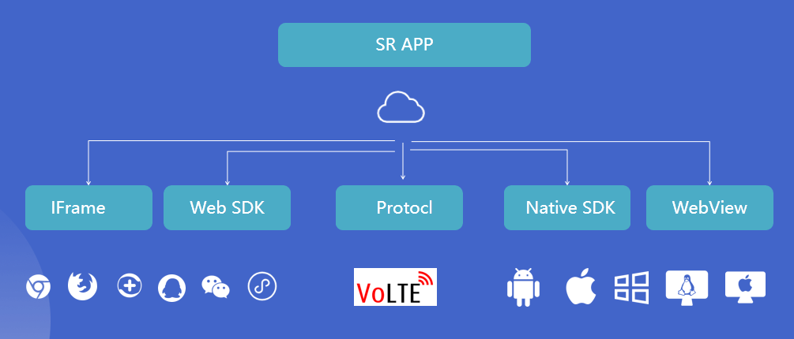
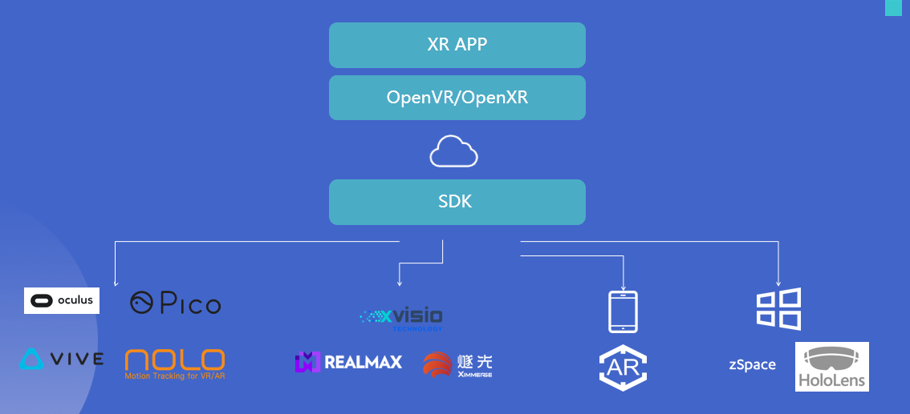

# About

---

[English](./README.md) [中文](./README.zh_CN.md)

---

[Paraverse](https://www.paraverse.cc/) We provide decentralized cloud rendering and Web3 transaction platform for XR & 3D assets.

## Demo and SDK List

| Product | Platform | Resorce |
| :-----| :----: | :----: |
| Server Release | Win | [Releases](https://github.com/ParaverseTechnology/LarkXR3.1/releases) |
| WebClient SR SDK | Browser | [Demos](https://github.com/ParaverseTechnology/lark_sr_websdk_demos) |
| WebClient Iframe | Browser | [Demos](https://github.com/ParaverseTechnology/larkwebclient-iframe-demos) |
| | MipApps | [uniapp demo](https://github.com/ParaverseTechnology/uniapp_demo) |
| Native XR SDK | Android XR Devices / Android Phone | [Dowload](https://github.com/ParaverseTechnology/larkxr_native_android_app/releases/) [Demos](https://github.com/ParaverseTechnology/larkxr_native_android_app) [AR DEMOS](https://github.com/ParaverseTechnology/larkar_demos) |
|| Win | DOING |
|| UWP(Holones) | DOING |
|| iOS | TO BE DONE |
| Native SR SDK | Android | [Only Donwload For Now](https://www.pingxingyun.com/devCenter.html) |
| | iOS |  TO BE DONE |
| | Win |  TO BE DONE |
| Unity XR SDK | Win/Andoird | [SDK](https://github.com/ParaverseTechnology/lark_xr_unity3d_client_plugin) |
| | UWP(Holones) |  DOING |
| Unreal XR SDK | Win/Andoird  | TO BE DONE |
| Unreal SR SDK | Win/Andoird  | TO BE DONE |
| DataChannel | C++/Unreal/Unity/ | [Download](https://www.pingxingyun.com/devCenter.html) / [Demos](https://github.com/ParaverseTechnology/lark_xr_unity3d_demos) |

## SR APP Developer

## XR App Developer

