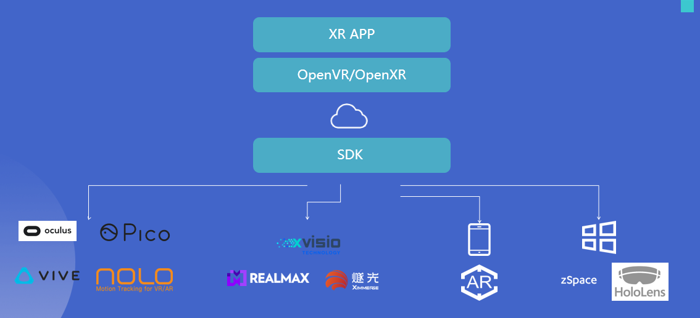

# 简介

[平行云](https://www.pingxingyun.com/) 提供实时云渲染标准产品和丰富的接入和二次开发方式。

本着开放，易用, 服务，扩展的基本原则，完善开放接口和接入SDK。

尽可能开源不同场景下接入方式和工具链帮助开发者打造更完美的实时云渲染产品。

## 开源和接入组件一览

| 产品 | 平台 | 资源 |
| :-----| :----: | :----: |
| Server Release | Win | [Releases](https://github.com/ParaverseTechnology/LarkXR3.1/releases) |
| WebClient SR SDK | Browser | [Demos](https://github.com/ParaverseTechnology/lark_sr_websdk_demos) |
| WebClient Iframe | Browser | [Demos](https://github.com/ParaverseTechnology/larkwebclient-iframe-demos) |
| | MipApps | [uniapp demo](https://github.com/ParaverseTechnology/uniapp_demo) |
| Native XR SDK | Android XR Devices / Android Phone | [Dowload](https://github.com/ParaverseTechnology/larkxr_native_android_app/releases/) [Demos](https://github.com/ParaverseTechnology/larkxr_native_android_app) [AR DEMOS](https://github.com/ParaverseTechnology/larkar_demos) |
|| Win | DOING |
|| UWP(Holones) | DOING |
|| iOS | TO BE DONE |
| Native SR SDK | Android | [Only Donwload For Now](https://www.pingxingyun.com/devCenter.html) |
| | iOS |  TO BE DONE |
| | Win |  TO BE DONE |
| Unity XR SDK | Win/Andoird | [SDK](https://github.com/ParaverseTechnology/lark_xr_unity3d_client_plugin) |
| | UWP(Holones) |  DOING |
| Unreal XR SDK | Win/Andoird  | TO BE DONE |
| Unreal SR SDK | Win/Andoird  | TO BE DONE |
| DataChannel | C++/Unreal/Unity/ | [Download](https://www.pingxingyun.com/devCenter.html) / [Demos](https://github.com/ParaverseTechnology/lark_xr_unity3d_demos) |

## SR APP Developer

## XR App Developer

