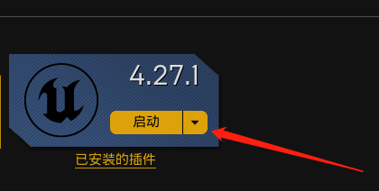
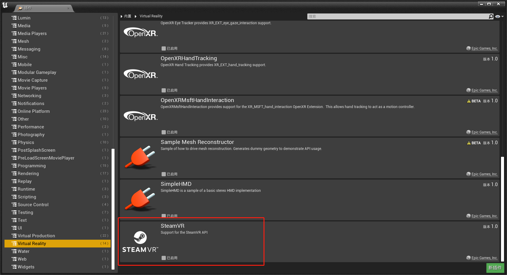
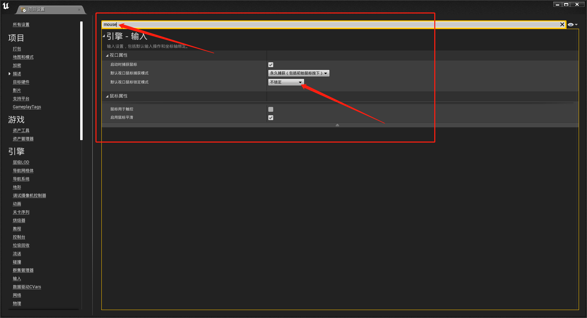
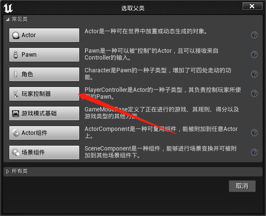
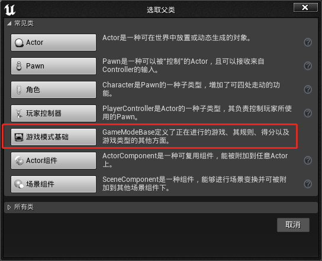

# 鼠标非锁定设置 Demo 制作过程

## 首先启动引擎，这里安装的是 4.27.1 版本



## 选择项目模板, 这里选择第三人称


## 项目插件设置，取消 vr 插件主要为了提高编译速度



## **设置鼠标模式** 重点设置项目，要设置成不锁定模式才能不锁定鼠标



## 设置显示鼠标指针

1. 新建玩家控制器



2. 设置显示鼠标光标


3. 新建游戏模式



4. 设置之前新建的玩家控制器


5. 设置当前游戏模式为刚才新建的游戏模式

## 打包发布

打包发布成功之后，设置窗口模式（推荐）

修改 GameUserSetting

```ini
[/Script/Engine.GameUserSettings]
bUseVSync=False
ResolutionSizeX=1280
ResolutionSizeY=720
LastUserConfirmedResolutionSizeX=1280
LastUserConfirmedResolutionSizeY=720
WindowPosX=-1
WindowPosY=-1
bUseDesktopResolutionForFullscreen=True
FullscreenMode=2
LastConfirmedFullscreenMode=2
Version=5
bUseDynamicResolution=False
PreferredFullscreenMode=1
AudioQualityLevel=0
LastConfirmedAudioQualityLevel=0
FrameRateLimit=60.000000
DesiredScreenWidth=1280
bUseDesiredScreenHeight=False
DesiredScreenHeight=720
LastUserConfirmedDesiredScreenWidth=1280
LastUserConfirmedDesiredScreenHeight=720
LastRecommendedScreenWidth=-1.000000
LastRecommendedScreenHeight=-1.000000
LastCPUBenchmarkResult=-1.000000
LastGPUBenchmarkResult=-1.000000
LastGPUBenchmarkMultiplier=1.000000
bUseHDRDisplayOutput=False
HDRDisplayOutputNits=1000
```