# 在 UE4 中使用 DataChannel 中附带 Demo Plugin

[下载数据通道_与应用通信](https://www.pingxingyun.com/devCenter.html) zip 包后，找到/3207 及以上版本适用/doc/unreal 找到默认的 Demo plugin 项目。

可以参考 Demo 项目进行数据通道 c++ dll 的集成也可以将 Demo 项目中的 Plugin 直接导入到现有项目中。

下面主要介绍直接将 Demo 中的 Plugin 导入到现有项目。

> 后续将推出完整的 UE4 插件。

## Demo Plugin 集成

1. 拷贝并导入 Demo Plugin

> Demo 项目使用 UE4.27 版本

直接将下载的zip包中的 Demo 项目的 Plugins 目录下的 LarkXRCloudApp 拷贝到现有的项目的 Plugins 下。

> 此处演示的是新建的一个项目，所以 Plugins 目录下没有其他文件。

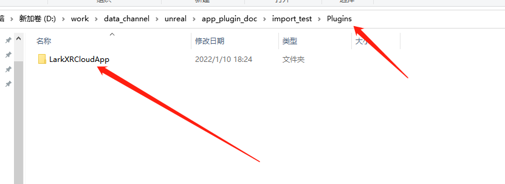

重新打开项目，打开插件菜单选择 LarkXRCloudApp 插件。

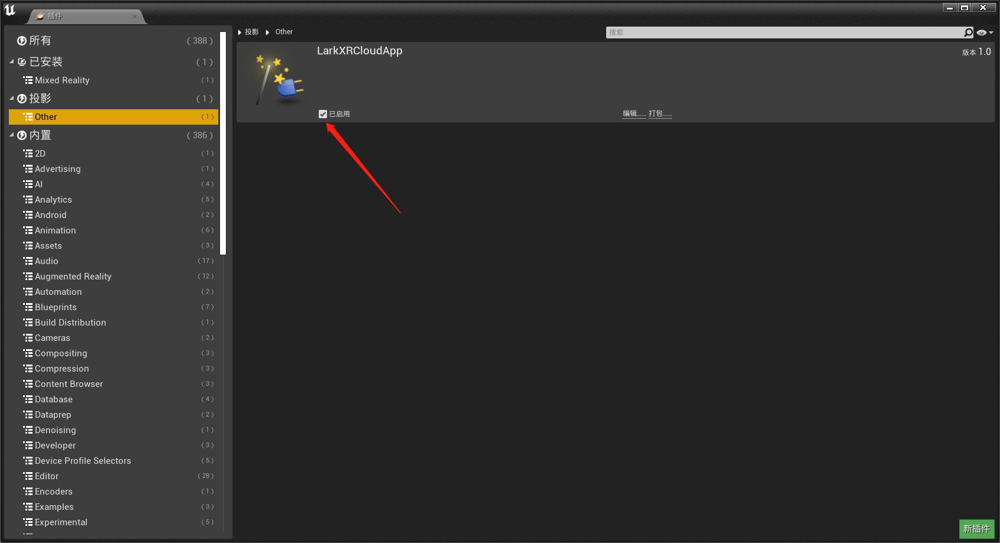

2. 新建 Actor 蓝图添加数据通道组件

首先保存当前关卡并设置默认关卡为当前保存的关卡。

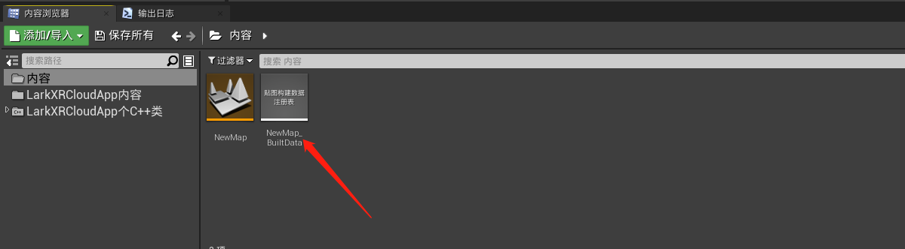

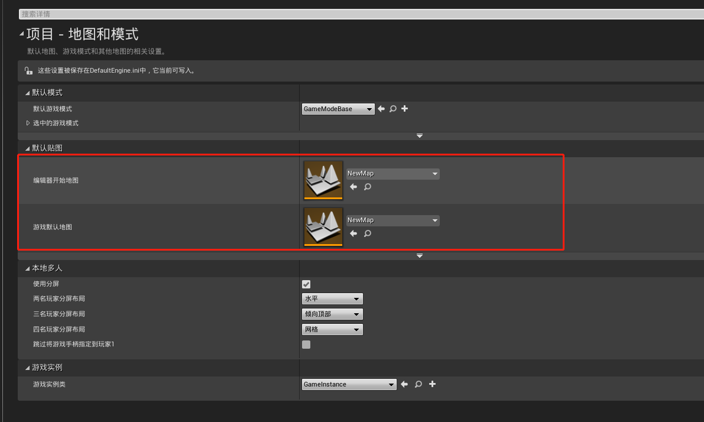

新建一个 Actor 并且添加 LarkXRCloudAppComponent

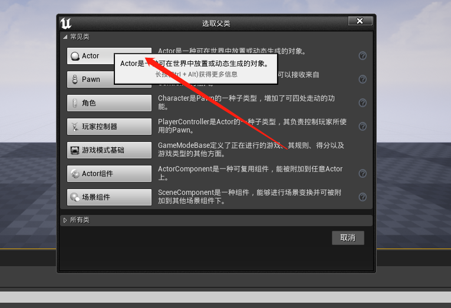

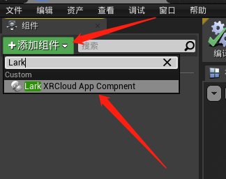

3. 启动数据通道

蓝图中数据通道函数名称都以 LR 打头，方便搜索。

首先在开始时添加 Task 信息回调函数注册调用和并启动数据通道功能。如下所示：

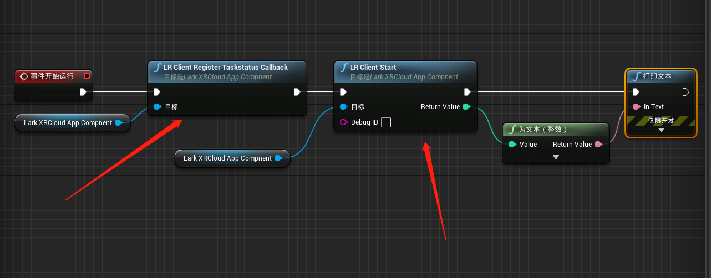

> 如果不注册回调函数 TaskStatus 代理事件将不起作用，但数据通道其他功能不受影响。

> TaskStatus 主要在应用被平行云 LarkXR 系统启动生命周期回调，如应用在云渲染系统中启动后将获得一个 TaskID，并切 TaskStatus 将变化为运行中。

4. 监听 TaskStatus 变化。添加如下代理事件可以监听 Task 的变化

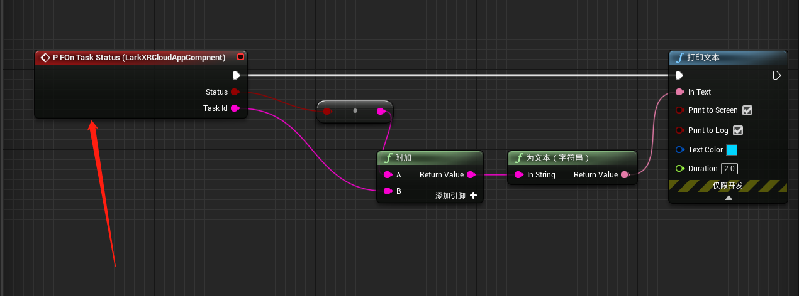

5. 监听收到的数据。添加如下代理可监听收到的字符消息

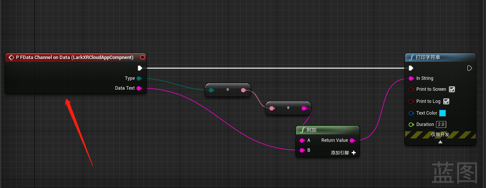

6. 关闭数据通道。调用LRClientStop函数即可关闭数据通道功能


7. 添加简单测试 UI

* 新建显示鼠标的游戏模式

首先新建一个显示鼠标的控制器，然后新建游戏模式并选择该控制器。然后将游戏模式选择为该显示鼠标的游戏模式。并设置不锁定鼠标。

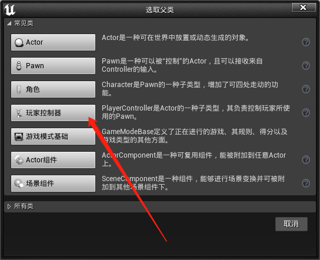

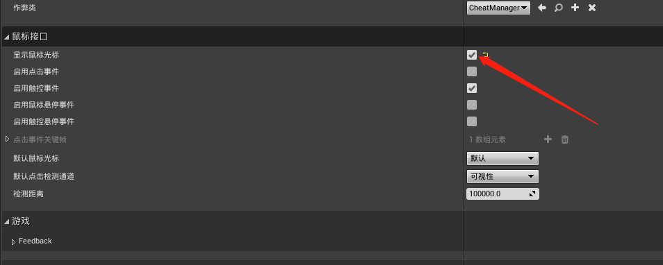

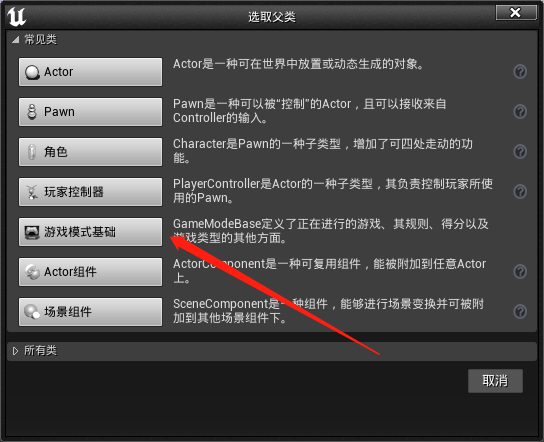

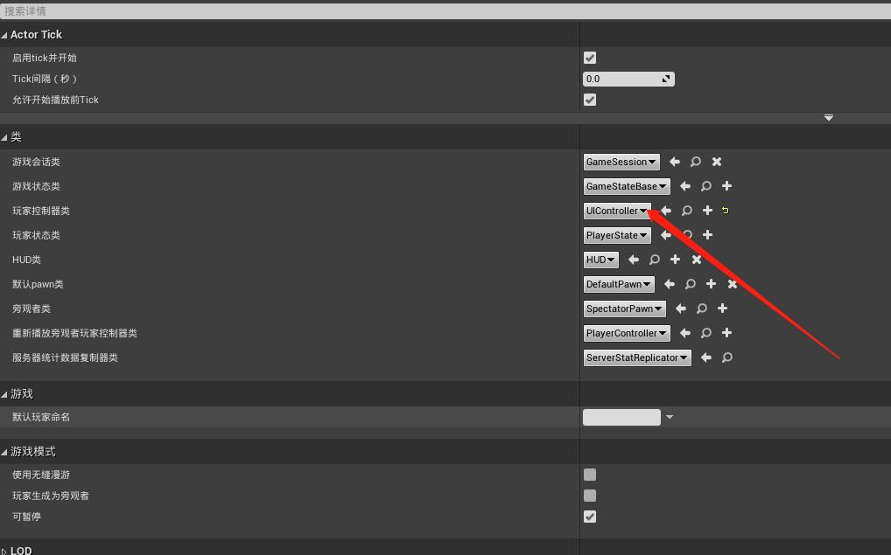

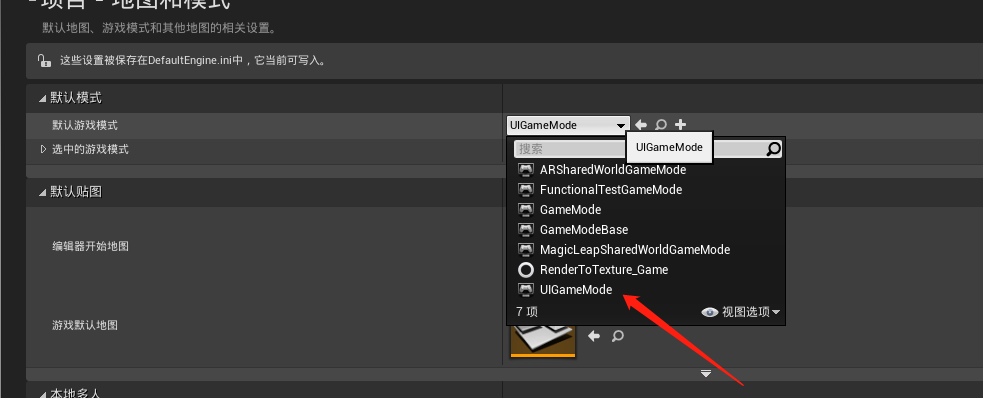

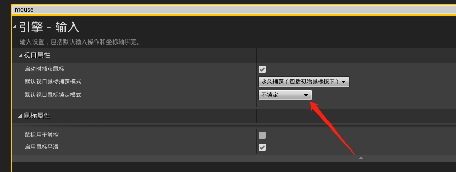

8. 添加测试 UI

添加一个 UI 空间蓝图，并更改关卡蓝图，当启动时创建该控件并添加到视口。


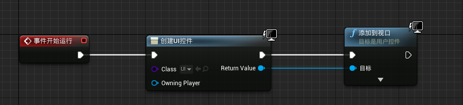

9. 添加测试 UI 输入文字并发送功能

添加一发送按钮和输入框。当点击发送按钮时，调用 LRClientSendText 发送字符串。

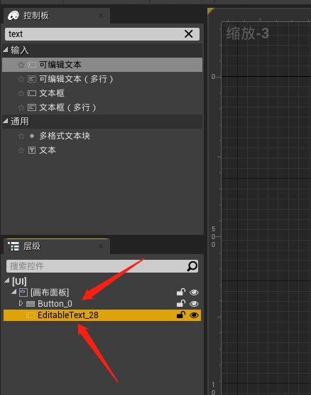

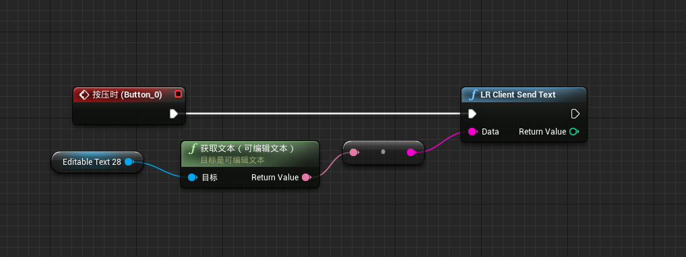

10. 将添加好的 Actor 添加到场景

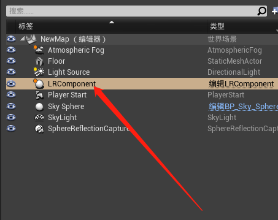

## Demo Plugin 打包测试

1. 打包 Win64 版本

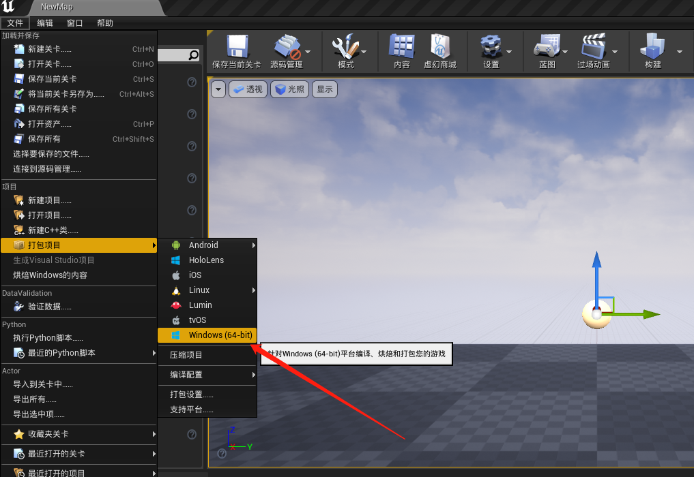

2. 上传到 LarkXR 后台

上传后应注意选择 Binaries64 文件夹下面的 exe

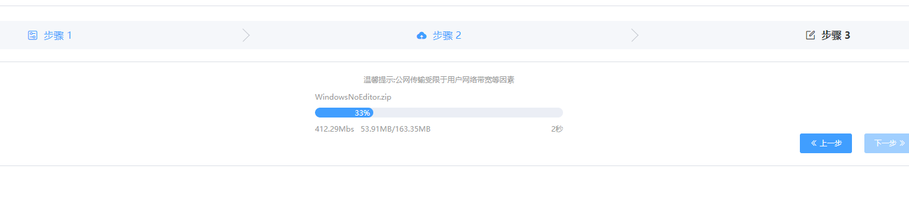


3. 在网页客户端启动调试


> 数据通道连通后可以根据业务需要进行网页的二次开发对接。
> 可参考项目[lark_xr_unity3d_demos](https://github.com/pingxingyun/lark_xr_unity3d_demos) [vh-webclient](https://github.com/pingxingyun/vh-webclient) 中的网页前端代码

## 智能语音相关功能

### LarkXRAiVoice.h

C++ 中可直接调用 LarkXRDataChannel64 中的接口

开启智能语音功能并注册回调函数,要注意在数据通道开启之后再启用智能语音功能

```c++
LARKXR_API int  DC_CALL lr_client_register_aivoice_callback(on_aivoice_callback cb,void* user_data);
```

回调数据结构

```c++
struct AiVoicePacket
{
  bool	url;				//true :online audio url(mp3) .false: audio pack (pcm)
  unsigned int voice_id;		//语音ID
  const char* online_url;		//如果url为true,该字段为url地址,否则该字段为NULL 
  int	    url_size;			//url长度 包含\0
  const char* nlg;			//当前语音对讲的文本
  int	    nlg_size;			//对讲文本长度 包含\0

  //如果URL为false 那么下面字段描述每一个pcm包
  unsigned int slice_id;		//一个语音分片ID
  int		samples_per_sec;	//eg.16000
  int		channels;		    //eg.1
  const char* audio;			//数据包指针,如果 url 为true 该字段为空
  int		size_byte;			//每一包的字节数
  bool	last_packet;		//是否为最后一包
};
typedef void(*on_aivoice_callback)(struct AiVoicePacket* packet,void* user_data);
```

### 在蓝图中开启并订阅回调

> 当数据通道连接成功时开启智能语音服务功能


当 `LR_Client_Start` 成功之后通过 `LR_Client_AiVoice_Start` 启动智能语音功能

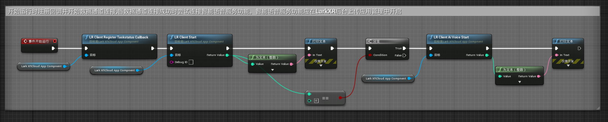


#### 打包发布

1. 服务器应确认有智能语音授权
2. 在 LarkXR `后台应用管理`-`通用高级设置`-`智能语音` 选择 `是`
