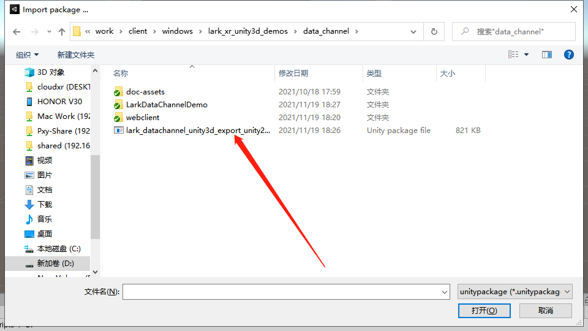
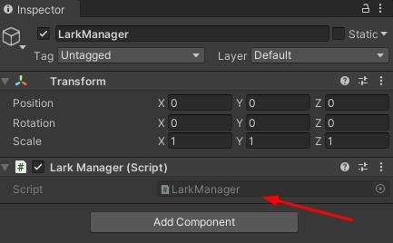

# 使用预发布的 Lark Plugin 接入

插件版本：[lark_datachannel_unity3d_export_unity2019.unitypackage](https://github.com/pingxingyun/lark_xr_unity3d_demos/releases/tag/3.2.1.0)

插件发布环境 Unity3D 2019.4.41f1 windows 版

插件功能

1. 管理和连接数据通道服务

## 导入和使用插件

### 导入插件

* 菜单栏选择 Assets->ImportPackage->Custom Package


* 找到 [lark_datachannel_unity3d_export_unity2019.unitypackage](https://github.com/pingxingyun/lark_xr_unity3d_demos/releases/tag/3.2.1.0) 文件存放位置并打开



* 勾选全部文件点击 Import


### 开始使用

* 在 Lark/Scripts/ 下找到 LarkManger 脚本


* 创建 empty object 并将 LarkManger 脚本挂载上



通过 LarkManger 实例即可调用插件提供的接口。如获取 TaskId

```cs
lark.LarkManager.Instance.TaskId
```

#### 数据通道服务

首先设置代理

```cs
// TaskStatus 通过监听 task 状态获取客户端连接情况。
// 在应用使用预启动功能时，应用保持长开启状态，当有客户端连接的时候
// Task 状态发生变化。
// status true:客户端连接 false:客户端断开
public delegate void OnTaskStatus(bool status, string taskId);
// 连接数据通道成功
public delegate void OnConnected();
// 收到文本消息
public delegate void OnTextMessage(string msg);
// 收到字节消息
public delegate void OnBinaryMessaeg(byte[] binary);
// 数据通道关闭
public delegate void OnClose(ErrorCode code);
```

通过 LarkManeger 实例获取 DataChannelNativeApi 实例并设置代理

```cs
lark.LarkManager larkManager = lark.LarkManager.Instance;
larkManager.DataChannel.onTaskStatus += OnTaskStatus;
larkManager.DataChannel.onConnected += OnConnected;
larkManager.DataChannel.onText += OnTextMessage;
larkManager.DataChannel.onBinary += OnBinaryMessaeg;
larkManager.DataChannel.onClose += OnClose;
```

开始连接

```cs
lark.DataChannelNativeApi.ApiRestult restult = lark.LarkManager.Instance.StartConnect();
```

发送字符消息

```cs
public void SendText(string txt)
{
    lark.LarkManager.Instance.Send(txt);
}
```

发送字节消息

```cs
public void SendBinary(byte[] data)
{
    lark.LarkManager.Instance.Send(data);
}
```

### Demo 场景

Demo 场景封装了基本使用流程，可配合 Web 客户端 Demo 一起使用。演示通过数据通道发送 json 封装指令等。


### 打包和发布

#### 打包

发布成 PC 版并发布到云雀系统上进行测试，并注意选择窗口全屏，*不要*选择独占全屏.


#### 上传

登录云雀后台，选择应用管理，添加应用


选择上传绿色版本


把发布好的应用程序压缩成一个 zip 文件并上传


### 智能语音功能

> 网页端智能语音输入 Demo 参考:https://github.com/pingxingyun/vh-webclient

> Lark Plugin 文件夹下保护一个 naudio 库，用于 Demo 场景中播放 mp3

#### StartAiVoice

如果使用智能语音服务器，应在 StartConnect 返回成功后启用智能语音连接

```cs
lark.LarkManager.Instance.StartAiVoice();
```

#### 智能语音相关回调

```cs
larkManager.DataChannel.onAiVoiceURL += OnAiVoiceURL;
larkManager.DataChannel.onAiVoiceStream += OnAiVoiceStream;
```

#### Demo 场景

Demo 场景中使用 naudio 库播放 mp3 URL。

```cs
// 开启使用 naudio 播放 mp3
#define ENABLE_NAUDIO
```

下载并使用 naudio 播放智能语音返回的 mp3 url

```cs
IEnumerator GetAudioClip(string url)
{
    UnityWebRequest www = UnityWebRequest.Get(url);
    yield return www.SendWebRequest();

    if (www.isNetworkError || www.isHttpError)
    {
        Debug.Log(www.error);
    }
    else
    {
#if ENABLE_NAUDIO
        byte[] results = www.downloadHandler.data;

        // 使用 NAudio 将 mp3 转换为 wave 播放
        using (var stream = new MemoryStream(results)) { 
            var reader = new Mp3FileReader(stream);
            var wo = new WaveOutEvent();
            wo.Init(reader);
            wo.Play();
            while (wo.PlaybackState == PlaybackState.Playing)
            {
                yield return new WaitForSeconds(1);
            }
        }
#endif
    }
}
```

#### 打包发布

1. 服务器应确认有智能语音授权
2. 在 LarkXR `后台应用管理`-`通用高级设置`-`智能语音` 选择 `是`