# Get started with LarkXR Quest Client

## Install app with SideQuest

1. Download and install SideQuest https://sidequestvr.com/setup-howto

2. Install LarkXR Quest client

* Enable Quest Debug mode

* Plugin Quest to PC

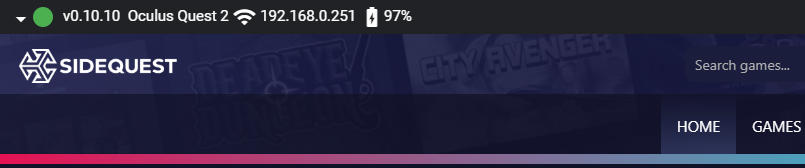

* Install `lark-xr-****-build-1-quest-openxr-beta-all.apk` with install button

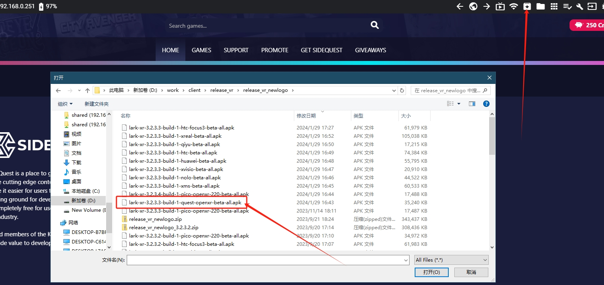

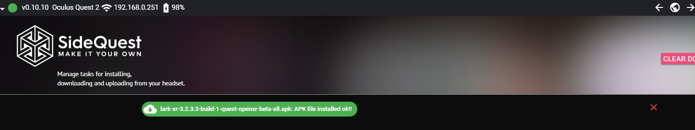

* Install with adb command (option)

```cmd
adb install [path to lark-xr-****-build-1-quest-openxr-beta-all.apk]
```

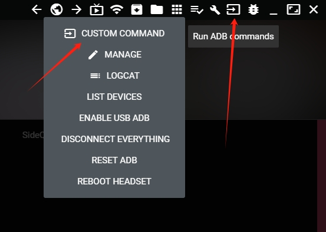

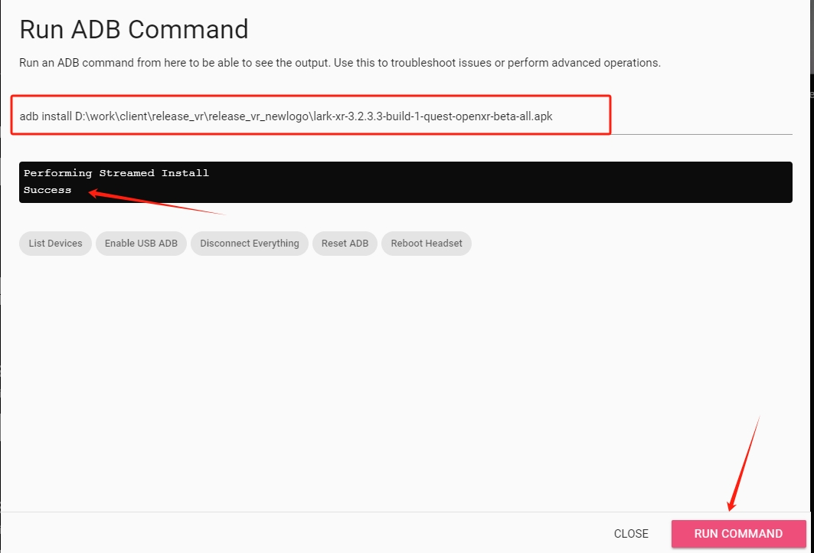

## LarkXR Quest Client

1. Find LarkXR Meta OpenXR Client on Unknown source in quest

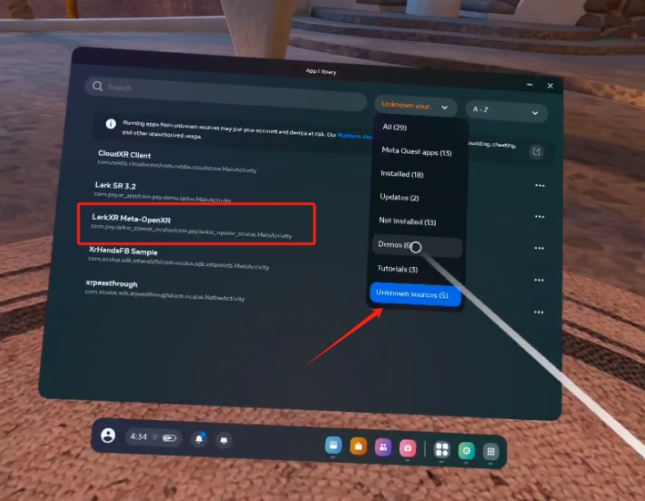

2. Enter LarkXR Client and setup LarkXR server ip

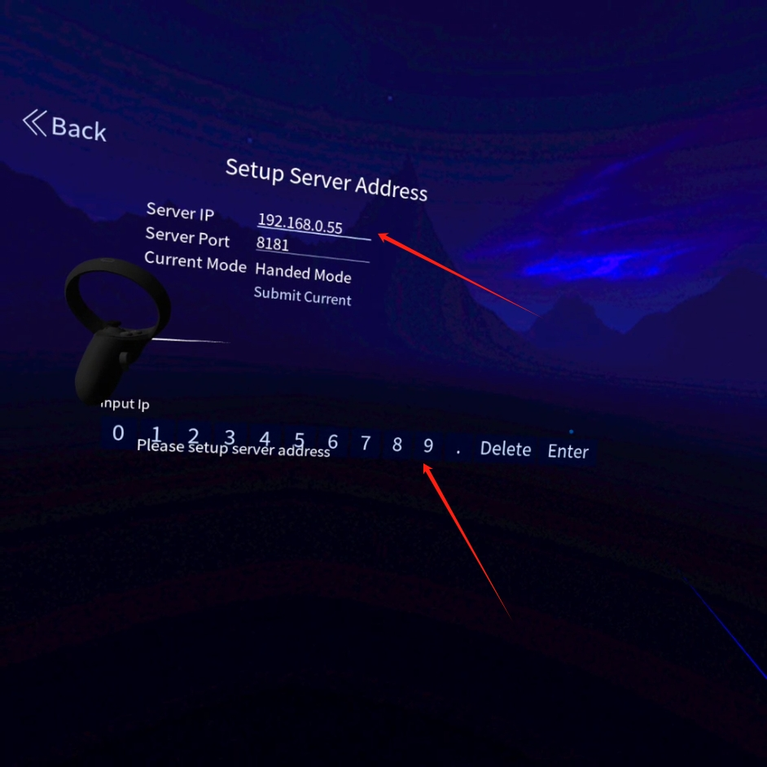

3. Back to applist and enter selected cloud app with A button

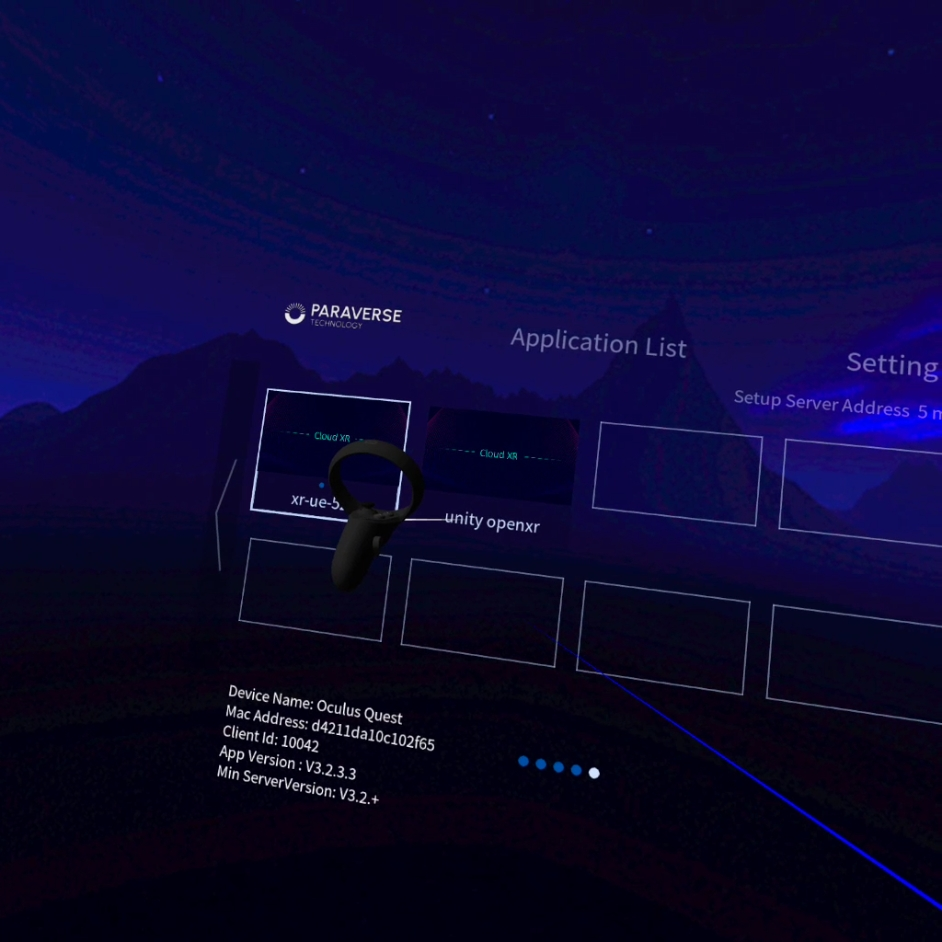

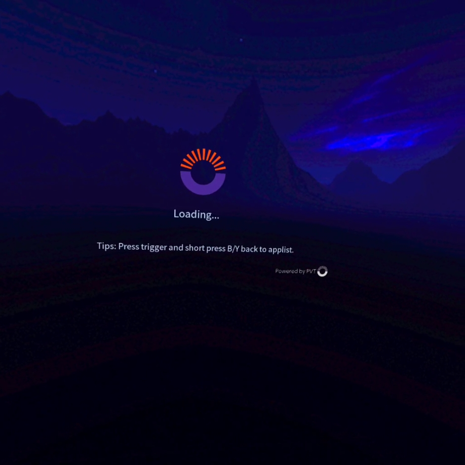

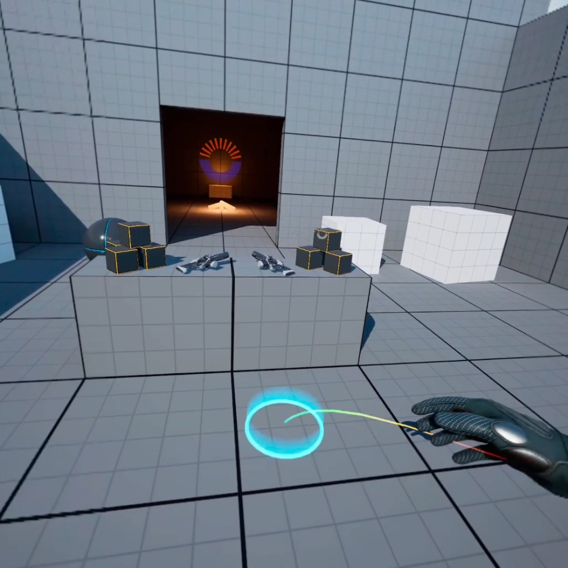

4. Press trigger and short press B/Y at same time show exit dialog

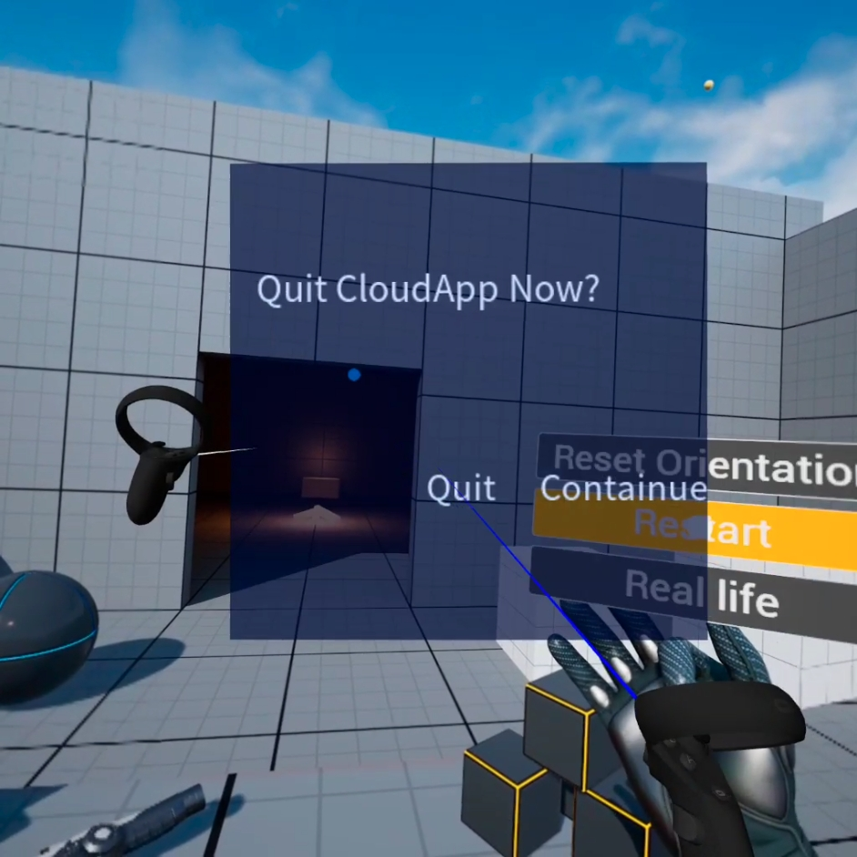

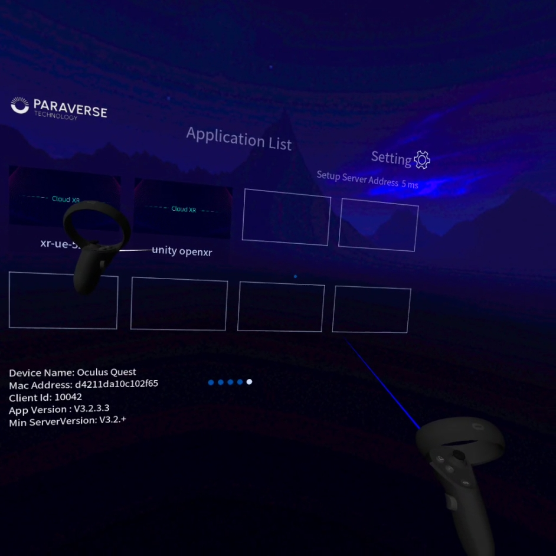
