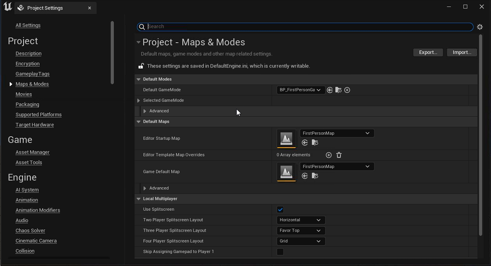

# Quick START - Unreal

1. Create project.


2. Config and Pacakge to widnows




3. Check running and get command line param.

```cmd
..\..\..\MyProject\MyProject.uproject
```


4. Package to zip file


4. Upload zip file to LarkXR


5. Setup cloud app info

> note: Args set to

```cmd
..\..\..\MyProject\MyProject.uproject
```


6. Enter cloud app from browser.


