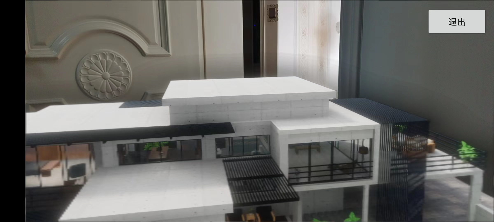

# LarkXR-AR

## 简述

使用[LarkXR SDK](https://github.com/pingxingyun/larkar_demos/releases) 可接入 arcore 或 hw arengine 实现云 AR 效果。

并且我们开源接入的项目[LarkAR Demo](https://github.com/pingxingyun/larkar_demos/)以供二次开发参考。

[LarkAR Demo](https://github.com/pingxingyun/larkar_demos/) 包括 AR Android 客户端（接入平行云 LarkXR SDK），一个 Unity3D 云端示例应用和一个 Unreal4.27 示例应用。

```
phone
-------------------                 ----------           ----------
|                  |                |        |           |         |
| arsdk(arcore...) |   streaimg     | LarkXR |  manange  |  XR App |
| larkxrsdk        | <=============>| Server |<=========>| OpenVR  |
|                  |  tracked pose  |        |           |         |  
-------------------                 ----------           -----------
```

客户端示例为如上图所示左边 phone 部分，接收云渲渲染的串流并发送姿态给云端。

LarkXR 服务器负责管理云端应用并通过 OpenVR 插件与 XR App 沟通。

Unity3D 示例和 Unreal 示例为上图右边 XR App 接入 OpenVR 的示例应用。

在 LarkXR Server 中上传部署的 XR APP 要选择 `AR(平行云AR方案)`

## [AR Android 客户端](https://github.com/pingxingyun/larkar_demos/tree/main/client_android_native)

* 接入 [google arcore](https://developers.google.com/ar), 支持 arcore 支持的机型
* 接入 [huawei arengine sdk](https://developer.huawei.com/consumer/cn/hms/huawei-arengine/)。 支持 huawei arengine sdk 支持的机型
* 云渲染接入 [LarkXR SDK](https://github.com/pingxingyun/larkar_demos/tree/main/client_android_native/larkar_android/lib_larkar/libs)
* 可选开启支持 CloudXR， 开启方式见 [CloudXR](./client_android_native/)
* 该项目还支持 webview 的 sr 项目云渲染。

接入具体文档见[./client_android_native/README.md](./client_android_native/README.md)



## [云端 Unity Demo 应用](https://github.com/pingxingyun/larkar_demos/tree/main/cloudapp_unity)

* 云端应用启用 OpenVR
* 默认播放动画
* 收到LarkXR数据通道传输的自定义数据时随机播放动画

接入具体文档见[./cloudapp_unity/README.md](./cloudapp_unity/README.md)

## [云端 Unreal Demo 应用](https://github.com/pingxingyun/larkar_demos/tree/main/cloudapp_unreal)

* 云端应用启用 OpenVR

接入具体文档见[./cloudapp_unreal/README.md](./cloudapp_unreal/README.md)
