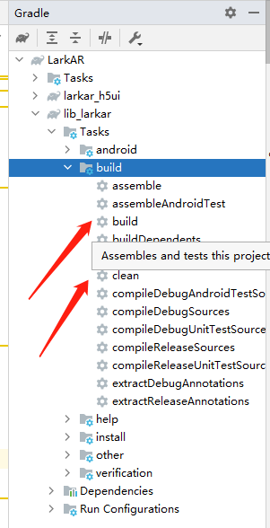

# [LarkAR 客户端接入Demo](https://github.com/pingxingyun/larkar_demos/tree/main/client_android_native)

## 简介

主要分为两部分

* VUE H5 做的列表页 UI, 对应 [ui_vue](https://github.com/pingxingyun/larkar_demos/tree/main/client_android_native/ui_vue/) 和 [./larkar_android/larkar_h5ui](https://github.com/pingxingyun/larkar_demos/tree/main/client_android_native/larkar_android/larkar_h5ui/)
* Android 原生接入 AR 流程,对应 [./larkar_android/lib_larkar/](https://github.com/pingxingyun/larkar_demos/tree/main/client_android_native/larkar_android/lib_larkar/)

其中 lib_larkar:
* 接入 [google arcore](https://developers.google.com/ar), 支持 arcore 支持的机型
* 接入 [huawei arengine sdk](https://developer.huawei.com/consumer/cn/hms/huawei-arengine/)。 支持 huawei arengine sdk 支持的机型
* 云渲染接入 [LarkXR SDK](https://github.com/pingxingyun/larkar_demos/tree/main/client_android_native/larkar_android/lib_larkar/libs)

## 如何使用

### 编译

Android Studio 打开 [./larkar_android/](https://github.com/pingxingyun/larkar_demos/tree/main/client_android_native/larkar_android/),首次编译应先执行 lib_larkar 的build 或 clean 任务，将自动解压原生 so 库等。



> 如果编译过程中出现找不到库的情况，请重新编译一次

### 运行

填入 LarkXR 的SDK ID，可以在 https://www.pingxingyun.com/console/#/ 或者联系商务部门申请

找到[ar_application.h](./larkar_android/lib_larkar/src/main/cpp/ar_application.h) 如下代码, 放开注释并在 `#define LARK_SDK_ID ""` 处填入 LarkSDKID, 注意接入的 SDKID 和服务器端的授权码是不同的。

```c++
//#define LARK_SDK_ID ""
#ifndef LARK_SDK_ID
#error "请配置SDK ID. 如果没有请联系商务获取. https://www.pingxingyun.com/index.html"
#endif
```

然后在支持 arcore 或者 huawei arengine 的真机上即可测试。

| 首次运行要填入 LarkXR 的服务器地址并检测环境

### 使用

* 使用时要配置好 LarkXR 服务器并上传好 `AR(平行云AR方案)` 类型应用.
* 在列表页有 AR 类型的应用时点击进入，启动 AR Activity
* 首先寻找一个平面，点击屏幕确定当前平面开始云渲染
* 连接云端画面成功后滑动屏幕旋转云端画面，双指放大或缩小

## 使用 LarkXR SDK 接入云渲染

在 [**projectroot**/lib_larkar/libs/larkxr-kit-**.aar](https://github.com/pingxingyun/larkar_demos/tree/main/client_android_native/larkar_android/lib_larkar/libs) 可以找到 LarkXR SDK，LarkXR SDK 主要提供 C++ 接口。 如何在 ndk 原生项目中使用 larkxr-kit-**.aar 获得 .h 和 .so 文件请参考 [**projectroot**/lib_larkar] 该模块的配置

### LarkXR SDK 主要流程都在 lark::XRClient 类中，以下列出示例中的关键代码

> 以下代码假定 lark::XRClient 对象为 `std::shared_ptr<lark::XRClient> xr_client_ = nullptr;`

#### 初始化

注意初始化 Init 函数要在 OpenGl 线程下调用。

```c++
xr_client_ = std::make_shared<lark::XRClient>();
xr_client_->Init(nullptr);
xr_client_->RegisterObserver(this);

if (!xr_client_->InitSdkAuthorization(LARK_SDK_ID)) {
    LOGE("init sdk auth faild %d %s", xr_client_->last_error_code(), xr_client_->last_error_message().c_str());
}
```

#### 进入应用

调用 XRClient 的 EnterAppli 即可进入应用, appid 可以从前端列表页传递过来

```c++
xr_client_->EnterAppli(appid_);
```

#### 渲染

如果连接成功并收到云端画面可以调用 XRClient 的 Draw 方法，主要要在 Opengl 渲染循环中调用。

```c++
xr_client_->Draw();
```

#### 上传姿态

上传姿态在 SDK 的 RequestTrackingInfo 回调中调用，SDK 会按设定的帧率回调。

针对 AR 类型的应用，上传相对于选定锚点的姿态，如下所示，传入锚点矩阵和摄像机view矩阵，SDK内容进行计算。

rotation_radius_ 可以对锚点进行旋转，实现旋转云端画面的功能。

```c++
void ArApplication::RequestTrackingInfo() {
    glm::mat4 raw_anchor;
    if (ar_manager_->GetRawAnchorPose(raw_anchor)) {
        xr_client_->SendArDevicePose(raw_anchor, ar_manager_->view_mat(), rotation_radius_);
    }
}
```

> 此处的关键点是要在 AR 系统中先选择好锚点。如果不上传姿态可能导致接收不到云端画面。

## AR SDK

Demo 中集成了 ARCore 和 Huawei AREngine，封装为统一的 AR 功能接口

* 接口 [ar_manager_interface.h](https://github.com/pingxingyun/larkar_demos/tree/main/client_android_native/larkar_android/lib_larkar/src/main/cpp/ar_manager_interface.h)
* arcore 实现[arcore](https://github.com/pingxingyun/larkar_demos/tree/main/client_android_native/larkar_android/lib_larkar/src/main/cpp/arcore/)
* huawei arengine 实现[hw_arengine](https://github.com/pingxingyun/larkar_demos/tree/main/client_android_native/larkar_android/lib_larkar/src/main/cpp/hw_arengine/)

## 开启 CloudXR 支持

1. 在云雀服务端上传应用类型未 CloudXR AR 类型的应用
2. 在将 CloudXR.aar 放到 [/client_android_native/larkar_android/libs/](https://github.com/pingxingyun/larkar_demos/tree/main/client_android_native/larkar_android/libs/) 文件夹下
3. 将 [/client_android_native/larkar_android/config.gradle] BUILD_WITH_CLOUDXR_SUPPORT 这种为 ture，重新编译

## 修改 H5 UI

参考 [ui_vue](https://github.com/pingxingyun/larkar_demos/tree/main/client_android_native/ui_vue/) 中的源码修改 UI.
H5 UI 和 Android 原生交互部分参考 [MainActivity.java](https://github.com/pingxingyun/larkar_demos/tree/main/client_android_native/larkar_android/larkar_h5ui/src/main/java/com/pxy/larkar_h5ui/MainActivity.java)
