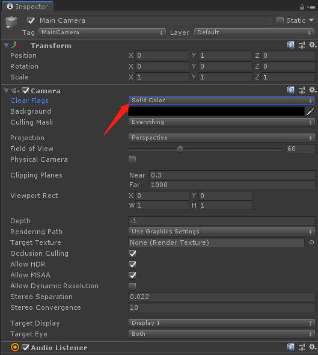

# CloudXR AR 云端应用要求

> CloudXR 基于 steamvr 实现基本功能，如何开发支持 steamvr 的应用开发主要参考各个平台的官方文档

## 使用 openvr 原生开发

云端应用首先接入 OpenVR，提交左右眼的时候，使用左眼包含 RGBA 信息。使用左眼中的 alpha 通道来混合摄像头的画面。右眼的纹理数据是被忽略的，提交一个小的假的纹理或者跟左眼一样的就行。

## 使用 unreal 开发

> 测试引擎版本 4.26.2

> 有关 unreal 开发 steamvr 应用的细节参考官方文档 https://docs.unrealengine.com/zh-CN/SharingAndReleasing/XRDevelopment/VR/SteamVR/BestPractices/index.html

1. 启用 steamvr 插件

2. 程序启动时启动 VR 模式

3. 删除原有的天空盒

删除原有的天空盒背景之后场景中的模型将叠加在相机画面上, 背景就是透明的了。

4. 设置SteamVR的相机

参考官方文档 https://docs.unrealengine.com/zh-CN/SharingAndReleasing/XRDevelopment/VR/SteamVR/HowTo/SeatedCamera/index.html 进行相机的设置

根据具体需要设置坐立式相机或者站立式相机

## 使用 unity3d 开发

> 测试引擎版本  2018.4.28f1

> 最新版本 unity 启用 xr 支持的方法请参考官方文档

1. 启用 openvr 支持,在 player setting 最下面找到 XR Setting，勾选 Virual Reality Supported

2. 设置摄像机背景颜色,摄像机 Clear Flags 选择 Solid Color，背景颜色选择 [0,0,0,0]

