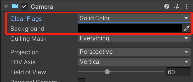
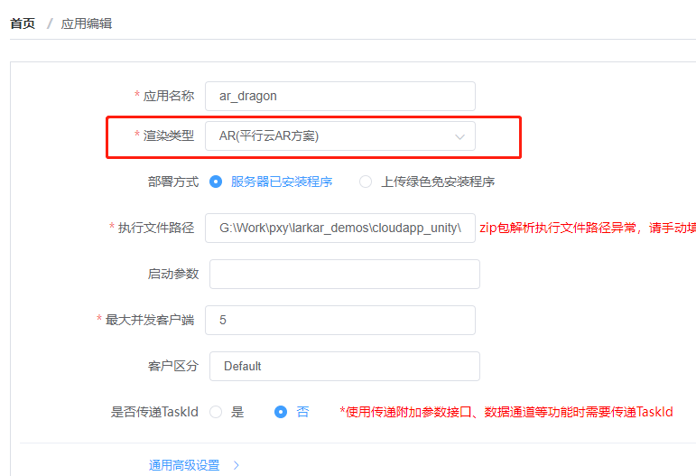
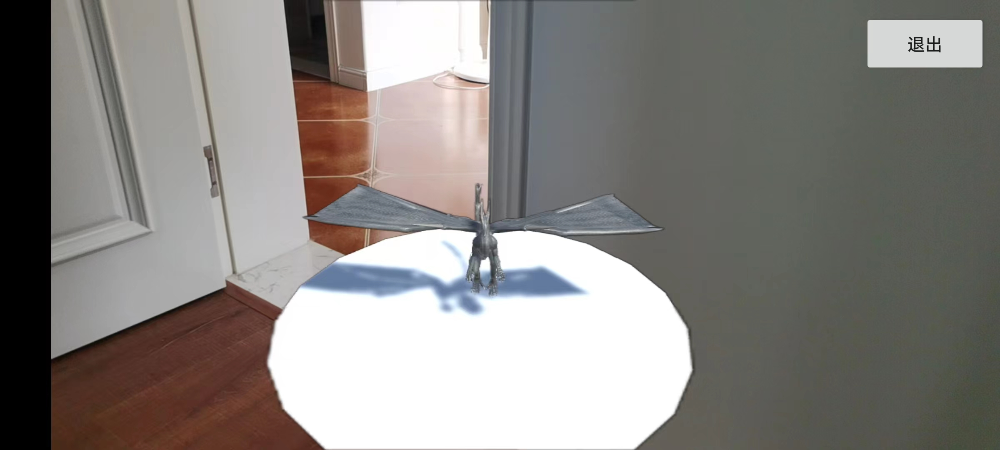

# LarkAR 云端 Unity 应用接入 Demo

## OpenVR 支持

云端应用主要需要集成 OpenVR 支持，Unity 新版的 XR System 中启用 OpenVR 的方式有所不同，可以参考 Untiy3D 的官网。

## 设置背景透明

设置场景中主 Camera，去掉天空盒，背景设置为 rgba(0,0,0,0)。这样在跟客户端合成时可以获得一个透明的背景。

## Demo Scene

[SampleScene.unity](https://github.com/pingxingyun/larkar_demos/tree/main/cloudapp_unity/ar_dragon/Assets/Scenes/SampleScene.unity) 演示在 AR 场景中添加一个带动画的模型。

动画模型控制由[Controller.cs](https://github.com/pingxingyun/larkar_demos/tree/main/cloudapp_unity/ar_dragon/Assets/Scenes/Controller.cs)脚本完成。

该场景也载入了 LarkXR DataChannel 插件，演示从客户端收到自定义数据，并执行相应动作。

## 发布

在 LarkXR 平台应用管理上传打包好的应用，要注意类型选择为平行云 AR 方案。

## 客户端访问效果

