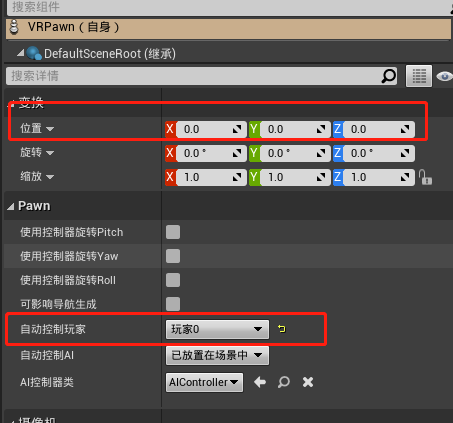
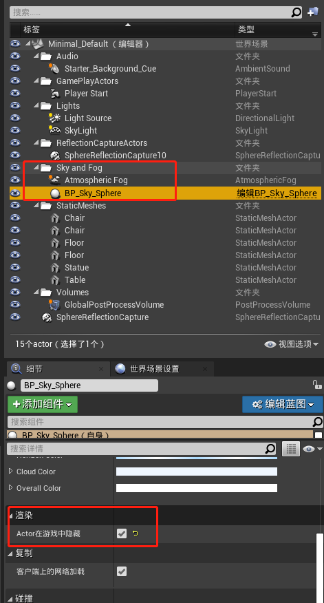

# LarkAR 云端 Unreal 应用接入 Demo

## OpenVR 支持

参考 [设置SteamVR的站立式相机](https://docs.unrealengine.com/4.27/zh-CN/SharingAndReleasing/XRDevelopment/VR/VRPlatforms/SteamVR/HowTo/StandingCamera/)

云端应用主要需要集成 OpenVR 支持，在 Unreal 中具体步骤如下：

* 确保启用 steamvr 插件

* 确保启动时启用VR模式

* 设置站立式相机

1. 新建 VRPawn 蓝图并添加一个场景组件和一个Camera

2. 在该蓝图中添加事件开始运行时执行设置追踪原点（Set Tracking Origin）节点

3. 将该 Pawn 添加到场景中并且设置为自动控制玩家。

## 设置背景透明

在云渲染 AR 模式下，需要将视频与摄像机画面叠加起来。要设置 Unreal 渲染处透明背景。

* 首先关闭天空盒和雾等背景。勾选在游戏中隐藏。

* 在设置中搜索 alpha，在后期处理选项中选择允许通过色调映射器选项。

> 开启该选项后需要重新启动并重新编译着色器

* 上传到 LarkXR 后台，要注意*许通过色调映射器* 选项跟 LarkXR 后台 alpha 遮罩功能对应。如果不选择透明遮罩功能将导致客户端叠加的透明通道反向。

## 客户端访问效果

