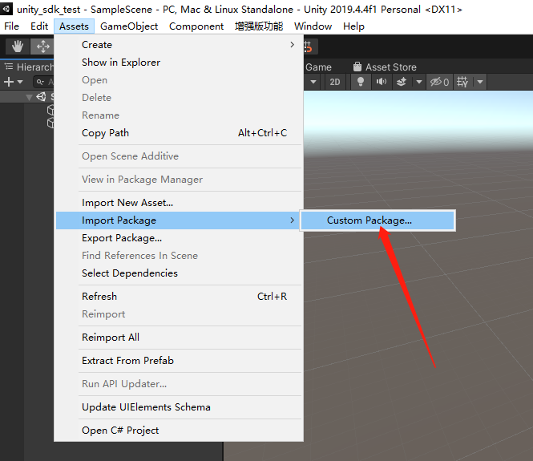
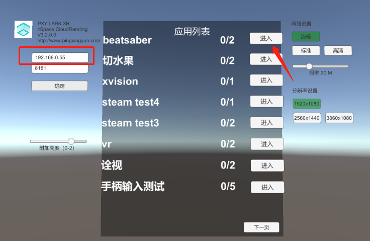

# LarkXR Unity3D Client SDK

## 简介

SDK 适用与开发接入 LarkXR 云渲染的 Unity3D 客户端。可用于接入不同的 XR 设备如 VR 头显，Zspace，手机 AR，AR 头盔等。

云端应用使用 OpenVR/OpenXR 开发。

SDK 封装 LarkXR 系统业务逻辑和流媒体交互能力。获取应用列表，后台上下线等。

SDK 输出云端渲染好的左右眼纹理，应用应该给 SDK 提供最新的姿态信息和手柄等控制信息。

### 支持平台

- [:heavy_check_mark:] Windows X64
- [:heavy_check_mark:] Android Phone
- [:heavy_check_mark:] [Zspace (Win64)](https://zspace.com/)
- [Doing] Holoens

参考连接：

[平行云产品介绍](https://www.pingxingyun.com/index.html)

[LarkXR 接入介绍](https://pingxingyun.github.io/)

[LarkXR 系统部署和文档](https://www.pingxingyun.com/devCenter.html)

[即刻体验](https://www.pingxingyun.com/experience/experience.html)

## 云渲染效果


## 快速开始

1. 导入 LarkXR SDK 自定义包




2. 打开 DemoScene


3. 填入 SDK ID

打开 DemoRender.cs, 修改第 38 行。

```c#
// 初始化 SDK ID 
string sdkID = "你的SDKID。如果没有SDKID请联系商务获取";

if (!XRApi.InitSdkAuthorization(sdkID)) {
    int errCode = XRApi.GetLastError();
    Debug.LogError("初始化云雀SDK ID 失败 code " + errCode);
}
```

4. 开始使用，填入 LarkXR 服务器地址。




填入 IP 服务器连接正常就可以看到云渲染的效果。

## 接口

### XRManager

手动挂载 XRManager 脚本或者调用 XRManager.Instance 即可获取到 XRManager 单例。

XRManager 将自动初始化。

> 要注意先设置 SDK ID

```c#
// 初始化 SDK ID 
string sdkID = "你的SDKID。如果没有SDKID请联系商务获取";

if (!XRApi.InitSdkAuthorization(sdkID)) {
    int errCode = XRApi.GetLastError();
    Debug.LogError("初始化云雀SDK ID 失败 code " + errCode);
}
```

### 代理

通过代理可获取到连接成功关闭，纹理等

onTexture2D,onTexture2DStereo 获取到云端渲染的纹理，分左眼和右眼。要根据设备和平台的具体要求正确显示左右眼的纹理。

```c#
// 监听连接关闭
XRManager.Instance.RenderManger.onClose += OnClose;
// 监听连接成功
XRManager.Instance.RenderManger.onConnected += OnConnect;
// 获取到左右眼纹理
XRManager.Instance.RenderManger.onTexture2DStereo += OnTexture2DStrereo;
// 获取到左右眼纹理,注意左右眼拼接到同一张纹理上。
XRManager.Instance.RenderManger.onTexture2D += OnTexture2D;
```

### 发送姿态信息

通过 XRApi.UpdateDevicePose 更新姿态信息。

调用 XRApi.SendDeivcePair 表示更新完成可以发送给云端。

在连接成功之后就要发送姿态信息，如果沒有姿态信息云端应用将沒有输出.

```c#
void Update()
{
    UpdateCamera();
    // 每帧发送姿态信息
    if (XRApi.IsConnected())
    {
        UpdateCloudPose();
    }
}
```

```c#
OpenVrPose openVrPose = new OpenVrPose(hmd.transform);
openVrPose.Position.y += LarkXR.Config.GetExtraHeight();
XRApi.UpdateDevicePose(XRApi.DeviceType.Device_Type_HMD, openVrPose.Position, openVrPose.Rotation);
XRApi.SendDeivcePair();
```

> 云端应用实际使用坐标系与 OpenVr 坐标系相同，需要将 Unity3D 坐标系转换为 OpenVr 坐标系。参考 OpenVrPose

### 设置项

```c#
// config render.
// 基本渲染设置
XRApi.RenderInfo renderInfo = XRApi.GetDefaultRenderInfo();
renderInfo.renderWidth = 1920;
renderInfo.renderHeight = 1080;
renderInfo.fps = 60;
XRApi.SetRenderInfo(renderInfo);

// 设置码率
XRApi.SetupBitrateKbps(50 * 1000);

// 是否输出左右眼是否在同一张纹理上面
XRApi.SetUseMultiview(true);
```

设置 IP

```c#
// update android server address;
XRApi.SetServerAddr(Config.GetServerIp(), Config.GetLarkPort());
```

> 更多关于设置相关参考 LarkXR/Scripts/UI/UIManager.cs

### 后台接口

XRManager 将自动开启后台接口请求 task，可通过代理获取到结果

```c#
// 获取应用列表成功
XRManager.Instance.TaskManager.onApplistSuccess += OnApplistSuccess;
// 获取应用列表失败
XRManager.Instance.TaskManager.onApplistFailed += OnApplistFailed;
```

> 更多关于接口相关参考 LarkXR/Scripts/UI/UIManager.cs
